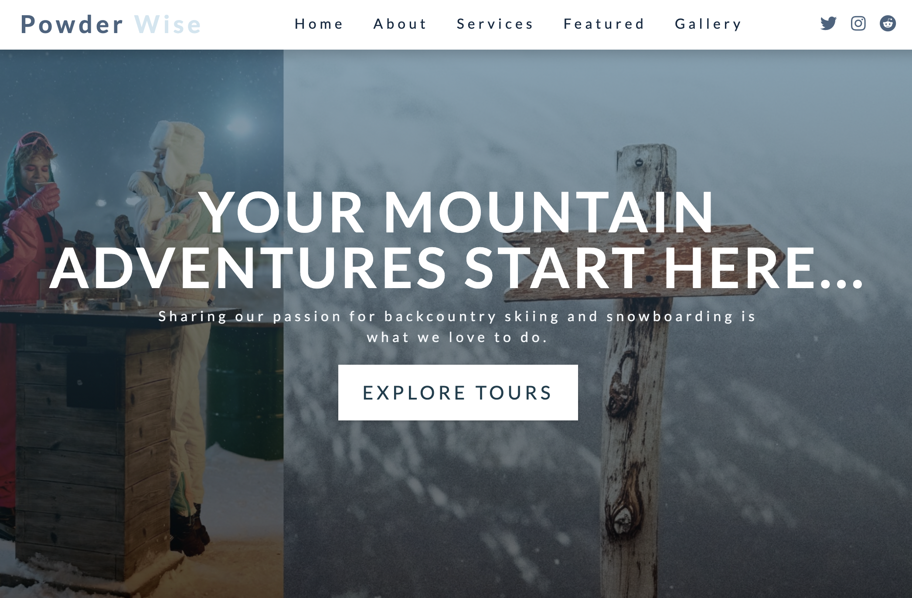
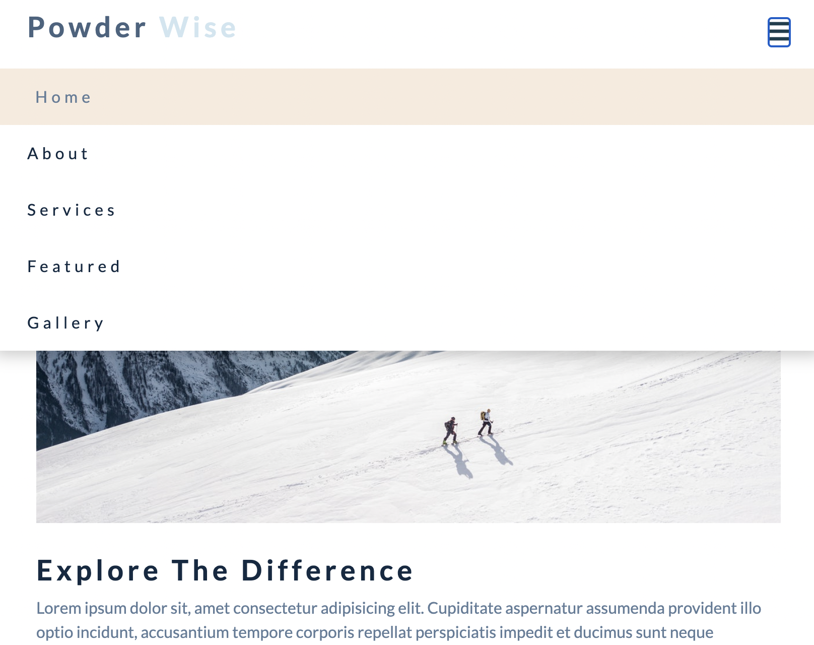
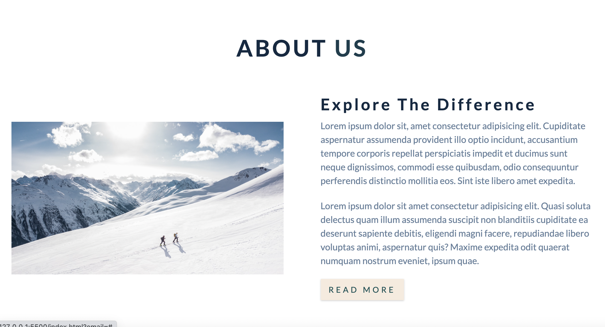
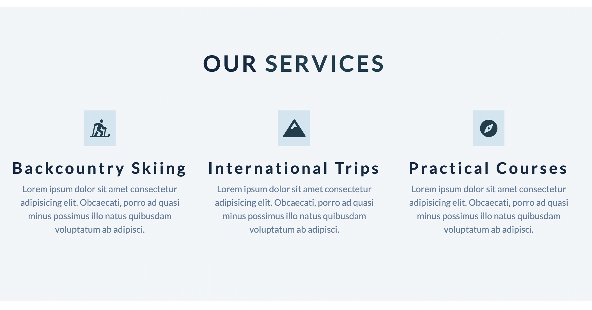
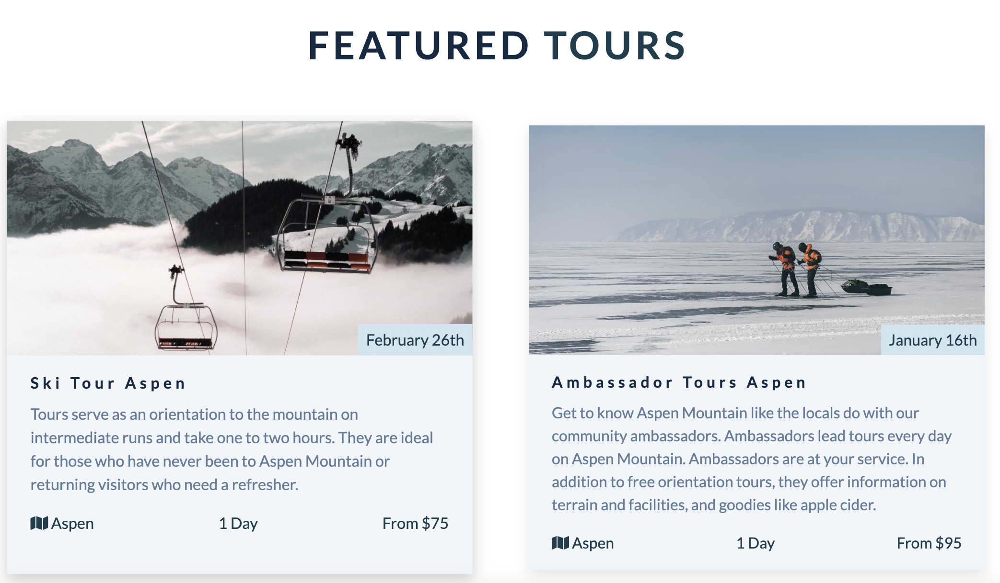
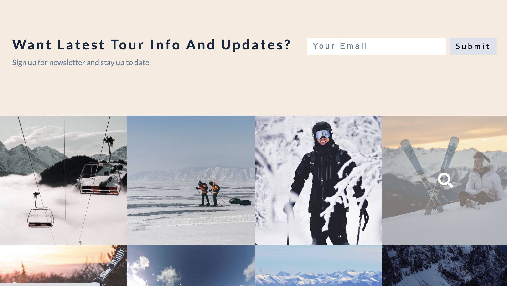

## CSS Flexbox project - POWDERWISE || ski guiding Aspen

- [See the project on Netlify](https://sweta-css-flexbox-ski-touring-powderwise.netlify.app)
- Project is inspired by CSS flexbox project in John Smilga [CSS tutorial](https://www.udemy.com/course/in-depth-html-css-course-build-responsive-websites/learn/lecture/18361130#content)
- Responsive website that contains:
  - Navbar with logo, links and social icons
  - Hero with title and call-to-action button
  - About section with two column layout; before pseudo element for the image, a border.
  - Servises section with three column layout
  - Featured tours; cards with hover effects
  - Contact form
  - Gallery
  - Footer with links and icons
  - JS functionality:
    - Toggling between sidebar and navbar
    - Smooth scrolling

    

  

    

  

    

  

    

  

    

  

    

  
